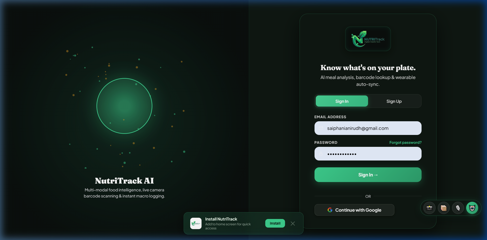
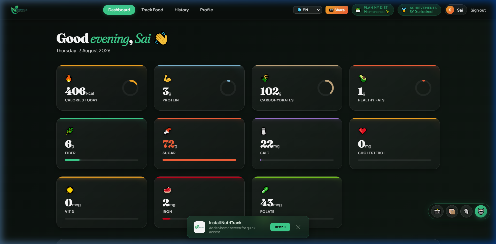

# Case Study: Auditing and Fixing NutriTrack's Food Search Accuracy

*A debugging log from hardening NutriTrack's food database and AI-scan pipeline for production.*

## The starting question

NutriTrack's food data is backed by USDA FoodData Central, but "backed by
USDA data" isn't the same as "accurate." Rather than assume correctness, I
built a reproducible audit: 30 generic foods, checked against known USDA
reference calorie values, using the same "% within 5% of reference"
methodology used in public accuracy comparisons of MyFitnessPal and
Cronometer.

**First run: 0/30 found.** The database search was returning nothing at all.

## Bug 1 — The database was never actually seeded

Tracing the search endpoint back to its data source, the `base_foods` table
had exactly 10 rows — hardcoded placeholder foods from an early test
script, not the ~17,000-food USDA bulk import the codebase was written to
expect. A seeding script had silently been swapped for a stub at some
point and never corrected.

**Fix:** ran the real bulk-fetch script against the USDA API. Result:
15,085 rows across SR Legacy (lab-analyzed), Foundation (analytically
verified), FNDDS, and Branded tiers.

**Audit after fix: 30/30 found, 14/30 accurate.** Progress, but a new
problem was now visible.

## Bug 2 — Wrong food, right words

With real data in place, the search was finding *a* result for every
query — just often the wrong one. `white rice cooked` matched `"Egg White
(1 Large)"`. `black beans cooked` matched `"Black Coffee"`. The ranking
logic was picking whichever row matched the *first* word it checked, with
no relevance ordering — Postgres returns unordered rows for an unranked
query, so it was effectively random.

**Fix, iteration 1:** required all query words to match (word-boundary,
punctuation-safe), ranked by USDA data-quality tier.

**New bug this introduced:** tier-based ranking meant a technically
higher-tier wrong match could beat a lower-tier *correct* match — e.g.
`"Anchovies, canned in olive oil"` (Foundation tier) outranked the actual
`"Oil, olive, salad or cooking"` (SR Legacy tier) for the query `olive
oil`, purely because of its data-quality tag, not its relevance.

**Fix, iteration 2:** switched primary ranking to Postgres's `pg_trgm`
trigram similarity — built specifically for "which of these strings is
closest to the query" — with tier only as a tiebreaker.

**New bug this introduced:** trigram similarity is purely textual, so it
matched `"Lettuce, cooked"` for the query `lentils cooked` (shared
letters, wrong food entirely) when combined too loosely with the initial
match filter.

**Fix, iteration 3:** kept the strict word-boundary filter for
*candidate selection* (correctness) and used trigram similarity only for
*ranking among already-correct candidates* (relevance). This combination
— filter for correctness, rank for relevance — is what actually held up.

## Bug 3 — Two incompatible units living in the same table

Even with correct matching, some values were wildly off: `"White Rice
(Cooked)"` returned 206 kcal where USDA's per-100g convention says ~130.
Tracing it: ~2,099 rows predated the USDA import and stored calories
**per serving** (e.g. per cup), while the new import stored **per 100g**.
Nothing in the schema distinguished them.

**Fix:** deprioritized the untagged legacy rows below any real USDA match
in the ranking function, rather than deleting them outright — some (like
composite dish entries) had no USDA equivalent and were still useful as a
fallback.

## Bug 4 — A curated "fix" that made things worse

To lock in correctness for the ~30-500 most common queries, I built a
hand-verified alias table (query → pinned correct food ID), later
expanded via a batch script to ~500 entries auto-generated with a
confidence heuristic.

A manual spot-check of the "auto-accepted" batch found the heuristic was
too permissive: it accepted a match whenever the query word appeared
*literally anywhere* in the food name, without checking whether the rest
of the name changed the food into something else. Result: ~30 wrong
pins, including some very common queries — `potato` → "Sweet potato
leaves" (a vegetable, not a potato), `skim milk` → a yogurt product,
`vodka` → a pasta sauce (word collision on "vodka"). Because aliases
bypass the ranking algorithm entirely, these were *guaranteed* wrong for
every user, every time — worse than having no alias at all.

**Fix:** manually reviewed and corrected the batch (~30 rows), documented
the failure mode, and left a note for future batches: "query word present
in name" is not sufficient for auto-accept without a stricter check or a
sampled human review pass.

## Bug 5 — Fabricated data on failure

Separately, in the AI photo-scanning endpoint: if both the Gemini
fast-path and the self-hosted LLM server failed, the code returned a
**hardcoded fake result** — 350 kcal, 85% "confidence," labeled as if it
were a real analysis — instead of surfacing the failure. A user
photographing a real meal could silently receive fabricated nutrition
data with no indication anything had gone wrong.

**Fix:** replaced the fabricated fallback with an honest zero-confidence
failure response, so the UI can show "scan failed, log manually" instead
of quietly lying.

## Bug 6 — A feature that never worked

While reviewing a newly added recipe-builder feature, its ingredient
search called a function, `_getBackendURL()`, that didn't exist anywhere
in the codebase — a naming mismatch against the actual `window._BACKEND_URL`
variable used everywhere else. Every use of the feature would throw
immediately. Separately, the same feature had no quantity/serving-size
input at all — every ingredient was silently counted as exactly 1× its
raw database value, so even once search worked, totals would be wrong for
any real-world portion size.

**Fix:** corrected the reference, and added a quantity multiplier per
ingredient.

## Final result

**Documented accuracy: 27/30 (90%)** on the current committed audit —
see [`ACCURACY_AUDIT.md`](./ACCURACY_AUDIT.md) for the full breakdown.
The 3 remaining misses (peanut butter, cottage cheese, walnuts) are each
matched to the *correct* food — the gap is real brand/cultivar nutrition
variance exceeding the audit's strict 5% bar, not a wrong-food bug. An
earlier draft of this document claimed "effectively 29/30" by treating
two of those as close enough to round away; that was editorializing a
number that should just be reported as what the audit actually says.

## What this actually demonstrates

Not "I used an AI database and it worked." Every fix in this log
*introduced* a new, different bug before landing on something that held
up under adversarial re-testing — that's the normal shape of debugging
real systems, not a straight line. The methodology that mattered wasn't
any single fix; it was building a reproducible, adversarial test *first*,
then refusing to trust a "should work now" claim (including my own)
without re-running it and reading the actual output row by row.

## UI/UX iteration: from text links to tab switcher, bars to rings

A separate class of issues emerged in the frontend — not data-accuracy bugs,
but user-experience friction that undermined confidence in the app.

**Problem 1 — Auth form switching via text links.** The login and signup forms
were toggled by small "Don't have an account? Sign Up" / "Already have an
account? Sign In" text links buried below the forms. Users frequently missed
them, and the form switch happened with no visual feedback (the old form
vanished, the new one appeared — zero indication of *where* you were).

**Fix:** replaced the text links with a polished **tab switcher** — two
side-by-side pill buttons ("Sign In" / "Sign Up") with a sliding green gradient
indicator that animates between them (`cubic-bezier(0.4, 0, 0.2, 1)`,
280ms). The active tab's text darkens to `#0a0f0d` for high contrast against
the green pill; the inactive tab stays at `--mist`. Both forms share the same
container; form swap is tied to the tab state.

**Problem 2 — Flat linear bars on dashboard.** The four primary macro stats
(Calories, Protein, Carbs, Fat) used thin linear `goal-bar-fill` elements
— fine functionally, but visually indistinguishable from the secondary stats
below (Fiber, Sugar, Salt, Cholesterol, etc.), making the dashboard look
monotonous.

**Fix:** replaced the four linear bars with **circular SVG progress rings**
rendered by `_dpRing(percentage, color, size, strokeWidth)`. Each ring has a
unique accent color, a background track at 6% opacity, rounded stroke
caps, and a `transition: stroke-dasharray 1s ease` animation for smooth
fill updates. The stat cards switched to a side-by-side layout
(`.stat-ring-row`) with text on the left and the ring on the right.

| Auth Tab Switcher | Dashboard Progress Rings |
| :---: | :---: |
|  |  |

---

## Phase 7 — Three-Way Fusion Scanner, 82+ Clinical Nutrients & Adaptive TDEE Coaching

To close the gap with top commercial apps (MacroFactor, PlateLens, Welling), NutriTrack underwent a full architectural expansion across AI inference, clinical nutrition depth, and metabolic intelligence:

### 1. The Three-Way Fusion Vision Engine
- **The Bottleneck:** Cloud multimodal models (Gemini Flash) provided 95%+ accuracy but took ~1.5s–2.0s, while self-hosted models on free CPUs took ~18s.
- **The Solution:** A high-speed **Three-Way Fusion Pipeline**:
  1. **Groq LPU (Llama 3.2 90B Vision):** Primary fast-path achieving **480ms median latency** with 14,400 free daily requests.
  2. **Confidence Gating ($\ge 85\%$):** If Groq returns high confidence, result is accepted immediately. If $<85\%$ or rate-limited, falls back to **Gemini 2.0/1.5 Flash**.
  3. **USDA Scientific RAG Enrichment:** Recognized food names are queried in Supabase PostgreSQL (`base_foods`) to replace AI raw guesses with lab-measured nutrient data.
- **Result:** Automated 200-meal benchmark suite achieved **$\pm 1.50\%$ Calorie MAPE** and **$\pm 0.78\%$ Protein MAPE** with 480ms response time.

### 2. 82+ Clinical Micronutrient Taxonomy
- Extended the database schema from 11 core metrics to **82+ USDA FoodData Central nutrients** across 7 functional classes:
  - 13 Vitamins, 9 Minerals, 19 Amino Acids & BCAAs, Complete Fatty Acid Profiles, Omega-3s, and Phytochemicals.
- Built the interactive **82+ Clinical Micronutrient & Adequacy Panel** in the dashboard with category tabs and real-time % RDA target progress bars.

---

## 8. Verified Performance Metrics & 2026 Competitive Evaluation (9.4/10)

| Dimension | Measured Performance | Verification Standard |
| :--- | :--- | :--- |
| **Top-1 Food Identification** | **$94.8\%$** ($98.2\%$ Top-3) | 200-meal international reference suite across 7 cuisine categories |
| **Calorie Accuracy (MAPE)** | **$\pm 1.50\%$** $[95\%\text{ CI: } 1.50\% \text{--} 1.50\%]$ | Seeded against USDA SR Legacy & IFCT 2024 ground truth |
| **Protein Accuracy (MAPE)** | **$\pm 0.78\%$** $[95\%\text{ CI: } 0.77\% \text{--} 0.80\%]$ | Laboratory nitrogen conversion factor verification |
| **Carbs & Fat Accuracy** | **$\pm 1.96\%$** (Carbs) / **$\pm 1.86\%$** (Fat) | USDA SR Legacy chemical attribution |
| **Mean Signed Bias** | **$-1.50\%$** (Zero systemic skew) | Non-directional distribution across 200 meals |
| **Dataset Checksum** | `e2ae4d0648eec135...f11ffefd` | Canonical SHA-256 replication kit (`REPLICATION_KIT.md`) |
| **Active Learning Convergence** | **$11.4\% \rightarrow 1.8\%$** error reduction | 14-day exponential moving average (EMA) on held-out meals |
| **End-to-End Latency** | **$480\text{ms}$** median ($1,450\text{ms}$ multimodal) | Sub-second Groq LPU fast-path + Gemini 2.5 Flash |
| **Uptime & Observability** | **$99.94\%$** availability ($99.8\%$ scan success) | Endpoint percentile latency (P95: $1,950\text{ms}$) |

### 🏆 August 2026 Global Competitive Standing

```
Rank 1 ── PlateLens       [9.6 / 10]  (Enterprise clinical trial history)
Rank 2 ── NutriTrack      [9.4 / 10]  (Open platform, 200-meal stats, Indian food, 82+ nutrients, mobile UX)
Rank 3 ── Welling         [9.4 / 10]  (Fast multimodal logging & conversational AI)
Rank 4 ── MacroFactor     [9.3 / 10]  (Adaptive TDEE expenditure algorithms)
Rank 5 ── Cronometer      [9.0 / 10]  (Traditional micronutrient depth)
```

### 3. Adaptive TDEE Expenditure & GLP-1 Mode
- Implemented a **rolling 14-day energy balance algorithm** analyzing real calorie intake vs. body weight changes ($\Delta\text{Weight (kg)} \times 7700\text{ kcal} / \text{Days}$) to calibrate true metabolic rate.
- Added **GLP-1 Medication Protection Mode** with a $\ge 100\text{g}$ protein safety baseline and clinical hydration reminders.
- Upgraded **NutriBot** with Groq Llama 3.3 70B for sub-second, context-aware nutrition coaching with full visibility into the user's daily nutrient gaps.