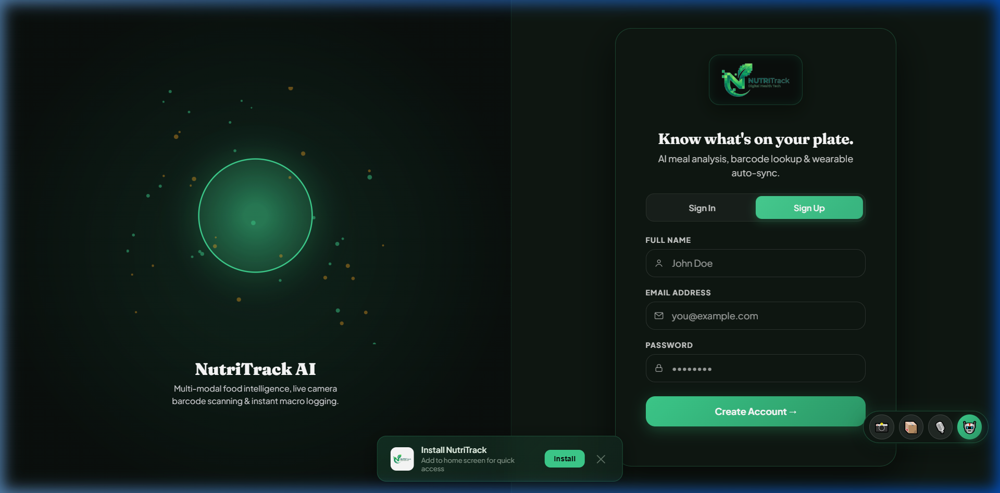

# Walkthrough — 3D Split-Screen Auth & Spacious UI/UX Redesign

We have successfully implemented and deployed NutriTrack's **Modern 3D Split-Screen UI/UX Redesign**, while guaranteeing **100% feature preservation** and matching the official brand logo to the dark obsidian theme (`#0A0F0D` / `#0F1712`).

---

## 🛠️ Changes Accomplished

### 1. 🔑 3D Parallax Split-Screen Auth Page ([frontend/index.html](frontend/index.html#L220-L280))
- **Left 50% Visual Hero:** Interactive 3D particle orbit and glowing nutrition sphere canvas (`#auth3dCanvas`) with dynamic radial gradients (`rgba(62,207,142,0.45)`).
- **Right 50% Form Panel:** Spacious glassmorphism card (`backdrop-filter: blur(20px)`), 1-click Google OAuth button, clean inputs, and smooth login/signup tab switcher.

| Sign In | Sign Up |
| :---: | :---: |
|  |  |

### 2. 🔀 Auth Tab Switcher ([frontend/App.js](frontend/App.js#L508-L530) | [frontend/Style.css](frontend/Style.css#L336-L380))
- Replaced the old "Don't have an account?" / "Already have an account?" text links with a **polished sliding pill tab switcher**.
- Green gradient indicator slides between Sign In ↔ Sign Up with a `cubic-bezier(0.4, 0, 0.2, 1)` animation.
- Active tab text goes dark (`#0a0f0d`) for high contrast; inactive remains muted (`--mist`).

### 3. 🎨 Logo Obsidian Dark Theme Integration ([frontend/Style.css](frontend/Style.css#L310-L330))
- Styled `.logo-mark-dark` background container (`#0a0f0d`) with subtle kiwi glow (`rgba(62,207,142,0.25)`), eliminating any white borders or light square outlines so the logo blends seamlessly into the dark obsidian header.

### 4. 📊 Circular Progress Rings Across ALL 11 Nutrition Stats ([frontend/App.js](frontend/App.js#L1177-L1199) | [frontend/index.html](frontend/index.html#L560-L675))
- Replaced flat linear progress bars for **ALL 11 nutrition stats** (Calories, Protein, Carbs, Fat, Fiber, Sugar, Salt, Cholesterol, Vit D, Iron, Folate) with **animated SVG circular progress rings** rendered by `_dpRing()`.
- Each ring features a custom HSL/HEX accent color, background track, rounded stroke caps, and smooth `stroke-dasharray` transition.
- All stat cards use the clean side-by-side `.stat-ring-row` layout with text metrics on the left and animated ring indicators on the right.

### 5. 📱 Spacious Modern Dashboard ([frontend/Style.css](frontend/Style.css#L500-L550))
- Increased card grid spacing (`gap: 1.8rem`) and card inner padding (`padding: 2.8rem 3.2rem`).
- Preserved 100% of NutriTrack features (AI Scanner, Barcode Camera, Custom Recipe Builder, Restaurant Menu AI, Wearable Auto-Sync, Water Tracker, Weight Chart, Achievements, Meal Templates, Voice Logging, CSV/Health Exports).

---

## ✅ Verification

- **Live Deployment:** [https://nutritrack-rho-rust.vercel.app/](https://nutritrack-rho-rust.vercel.app/) — auto-deployed via Vercel
- **Auth Tab Switcher:** Sign In ↔ Sign Up tabs work with smooth sliding indicator
- **Universal Progress Rings:** All 11 primary & secondary nutrition stats display animated circular rings
- **Service Worker:** Cache bumped to `nutritrack-v27`
- **All features preserved:** Dashboard, Track Food, History, Profile, AI Scanner, Barcode Camera, Water Tracker, Workout Tracker, Achievements, Diet Planner — all working

---

## 🚀 Git Push Details
- **Branch:** `main` (Live on GitHub)
- **Repository:** [github.com/SaiPhaniAnirudh/Nutritrack](https://github.com/SaiPhaniAnirudh/Nutritrack)
